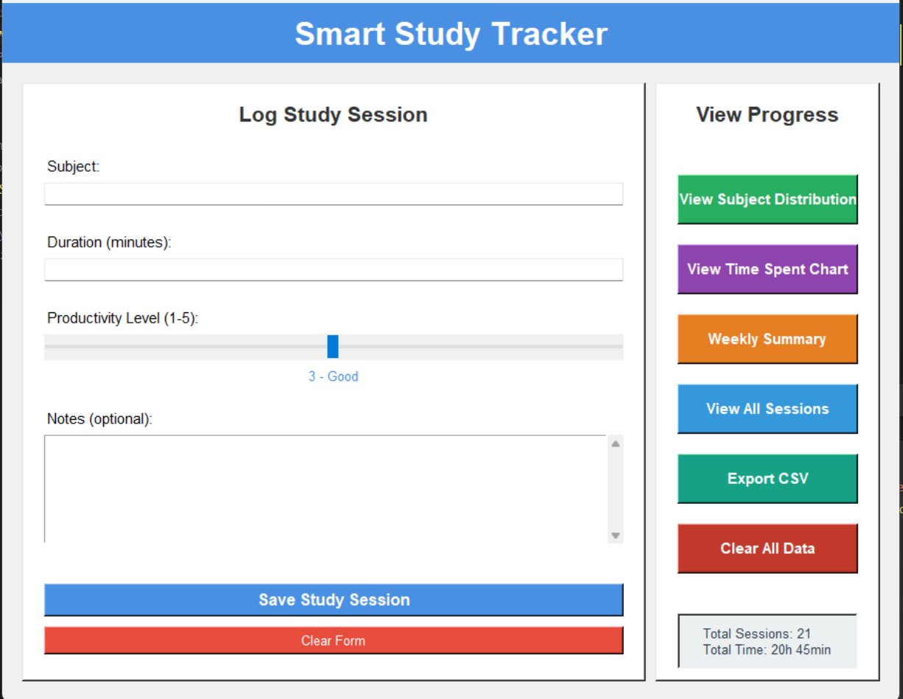
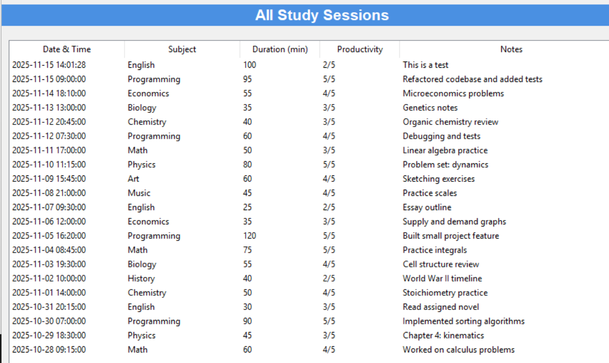
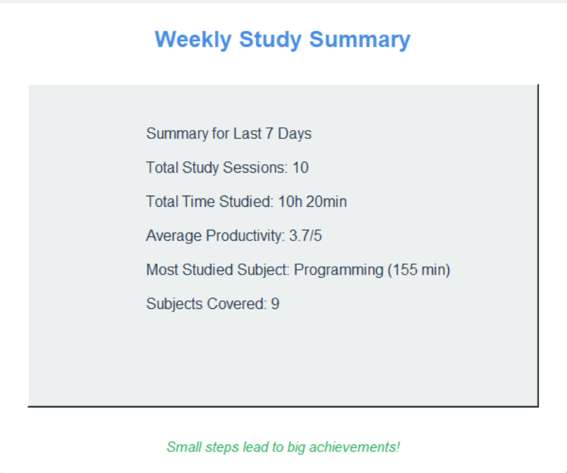
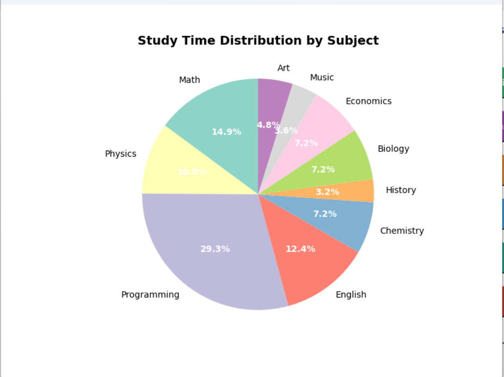

# Smart Study Tracker

A Smart study tracking application with GUI, data visualization, and progress monitoring built with Python and Tkinter.

## Features

- **Session Logging**: Track study sessions with subject, duration, productivity level, and notes
- **Data Visualization**: 
  - Pie chart showing study time distribution by subject
  - Time spent charts for visual analysis
- **Progress Monitoring**: 
  - Weekly summary with total sessions, time studied, and average productivity
  - View all study sessions in a sortable table
- **Data Management**: 
  - Export data to CSV for external analysis
  - Clear all data functionality
  - Persistent storage using JSON

## Screenshots

### Main Interface

*The main application window with session logging form and progress viewing options*

### All Study Sessions

*A view of all logged study sessions with date, subject, duration, productivity, and notes*

### Weekly Summary

*Summary statistics for the last 7 days including total sessions, time studied, and most studied subject*

### Subject Distribution Chart

*Pie chart visualization showing the percentage of time spent on each subject*

## Installation

1. **Clone the repository**:
   ```bash
   git clone 
   cd tracker_app
   ```

2. **Create and activate a virtual environment**:
   ```powershell
   python -m venv .venv
   .\.venv\Scripts\Activate.ps1
   ```

3. **Install dependencies**:
   ```powershell
   pip install matplotlib
   ```

## Usage

Run the application:
```powershell
python main.py
```

### Logging a Study Session

1. Enter the subject name
2. Enter duration in minutes
3. Set productivity level (1-5) using the slider
4. Add notes
5. Click "Save Study Session"

### Viewing Progress

- **View Subject Distribution**: Pie chart of time allocation across subjects
- **View Time Spent Chart**: Bar chart showing study time patterns
- **Weekly Summary**: Statistics for the last 7 days
- **View All Sessions**: Complete table of all logged sessions
- **Export CSV**: Download your data in CSV format


## Requirements

- Python 3.13+
- tkinter
- matplotlib

## Data Storage

Study sessions are stored in `data/study_data.json` with the following structure:


## License

This project is licensed under the MIT License - see the [LICENSE](LICENSE) file for details.
